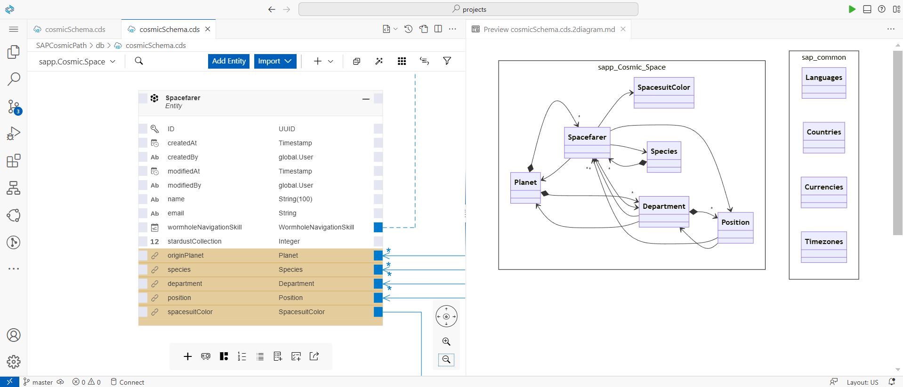
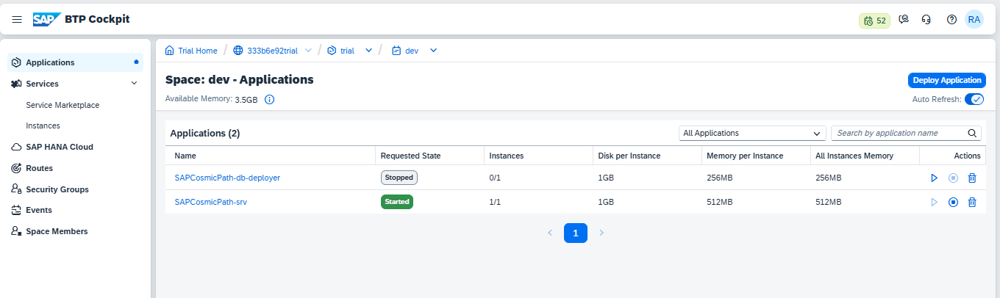
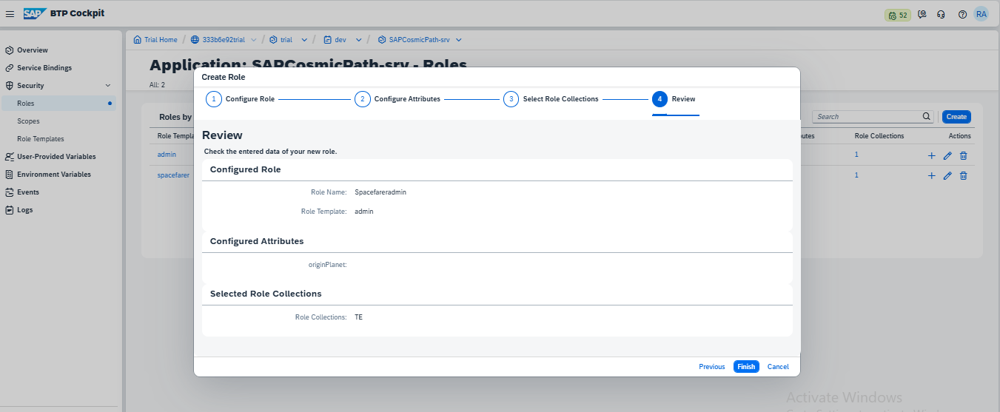
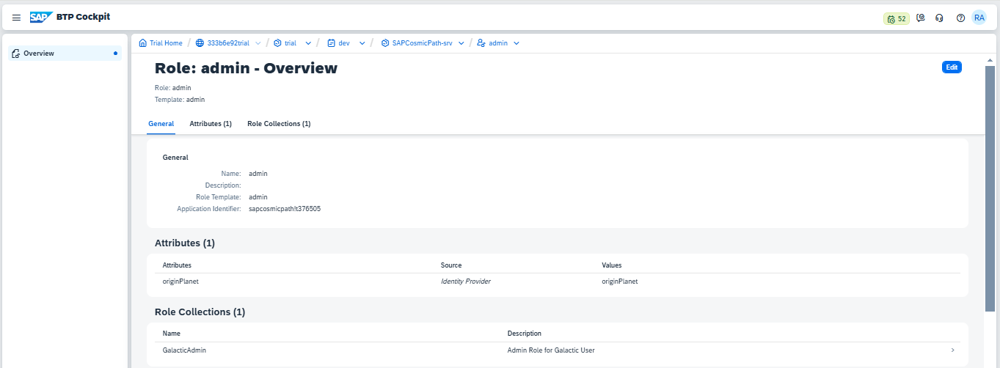
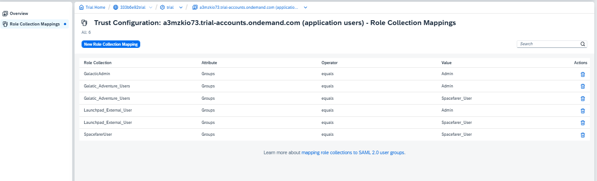
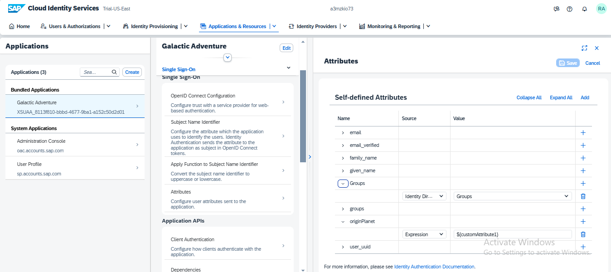
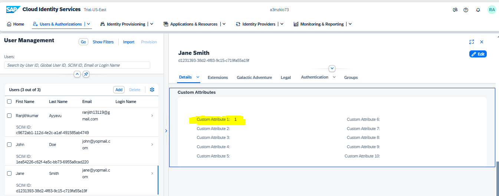

# Galactic Spacefarer Adventure  

## Table of Contents  
1. [Overview](#overview)  
2. [Multilingual Support](#multilingual-support)  
3. [Personas](#personas)  
   3.1 [Admin](#1-admin)  
   3.2 [Spacefarer](#2-spacefarer)  
4. [User Access](#user-access)  
5. [Authentication & Authorization](#authentication--authorization)  
   5.1 [SAP IAS Integration](#sap-ias-integration)  
   5.2 [Role-Based Access Control (RBAC)](#role-based-access-control-rbac)  
6. [Technology Stack](#technology-stack)  
7. [Tasks](#tasks)  
   7.1 [Task 1: Spacefaring Data Model](#task-1-spacefaring-data-model)  
   7.2 [Task 2: Cosmic Service Definition](#task-2-cosmic-service-definition)  
   7.3 [Task 3: Cosmic Event Handlers](#task-3-cosmic-event-handlers)  
   7.4 [Task 4: Galactic List & Object Report Fiori Application](#task-4-galactic-list--object-report-fiori-application)  
8. [Key Features](#key-features)  
9. [Folder Structure](#folder-structure)  
10. [Deployment to SAP Business Technology Platform](#deployment-to-sap-business-technology-platform)  
    10.1 [Prerequisites](#prerequisites)  
    10.2 [Build the Project](#build-the-project)  
    10.3 [Deploy to CF from BAS](#deploy-from-bas)  
    10.4 [Deploy to CF using CI&CD](#deploy-using-cicd--webhook) 
    10.5 [OriginPlanet Attribute Mapping](#originplanet-attribute-parameter-mapping-in-the-deployed-application)  
    10.6 [Role Collection with IAS Groups in Trust Configuration](#role-collection-with-ias-groups-in-trust-configuration)
    10.7 [IAS Setup](#ias-setup)
11. [Futher Enhancement](#further-enhancements)
---

## Overview  
The **Galactic Spacefarer Adventure** is a full-stack responsive application built using the **SAP CAP Framework** (Node.js, HANA, SAPUI5) and deployed on the **SAP BTP Cloud Foundry environment**. This application helps manage spacefarers' intergalactic adventures while maintaining strict role-based access controls.  


## Multilingual Support  
The **Galactic Spacefarer Adventure** application is available in the following languages:  
- **English** (Set as default and fallback language)  
- **German**  
- **French**  

## Personas  
### 1. **Admin**  
- **Permissions:**  
  - View all spacefarer information across different planets.  
  - Create, update, and delete spacefarer records.  

### 2. **Spacefarer**  
- **Permissions:**  
  - View their own information and other spacefarers who belong to the same planet.  
  - Update only their personal details (stardust collection, spacesuit color).  

## User Access  
- **Access Point:**  
  - Admins and Spacefarers can access the application via **SAP Work Zone** as a tile.  
- **Permissions Configuration:**  
  - Required permissions for the application tile and respective groups are assigned in **SAP IAS**.  
  - Trust configuration between **SAP IAS** and **SAP BTP** ensures secure authentication and access management.  

## Authentication & Authorization  
### SAP IAS Integration  
- **Identity Provider:** SAP Identity Authentication Service (SAP IAS) serves as the IDP for user login.  
- **Authentication Protocol:** OpenID Connect protocol is used to authenticate with SAP BTP.  
- **Role Assignment:**  
  - Admin and Spacefarer roles are assigned to respective groups in IAS.  
  - Each spacefarer’s planet information is stored in IAS under `customAttribute1`.  
  - This attribute determines which spacefarers the user can access.  

### Role-Based Access Control (RBAC)  
- Admins have full access to manage spacefarers from all planet.  
- **Spacefarer Role:**  
  - Spacefarers can only update their own records (based on their unique ID and data).  
  - Spacefarers can view data only for themselves and other spacefarers who belong to the same planet (as determined by their `customAttribute1` value in IAS).  

## Technology Stack  
- **Backend:** SAP CAP Framework (Node.js)  
- **Database:** SAP HANA (with SQLite for local development)  
- **Frontend:** SAPUI5  
- **Authentication:** SAP IAS (OpenID Connect)  
- **Access Point:** SAP Work Zone, Standard Edition  
- **Deployment:** SAP BTP Cloud Foundry  
- **Logs & Traces:** SAP Audit-Logging, SAP Application Logging  
- **DevOps:** SAP BTP CICD, SAP TMS  
- **Alerts:** SAP BTP Alert Notification, MailTrap   

## Tasks  

### Task 1: Spacefaring Data Model  
**Objective:** Define a data model for the Galactic Spacefarer entity.  
**Fields Included:**  
- Name  
- Email  
- Planet  
- Department  
- Position  
- Stardust Collection  
- Wormhole Navigation Skill  
- Spacesuit Color  
- Species 

```bash

entity Spacefarer : cuid, managed {
  name                    : localized String(100); // Spacefarer's name
  email                   : String @assert.format: '^[a-zA-Z0-9._%+-]+@[a-zA-Z0-9.-]+\.[a-zA-Z]{2,}$' ;
  wormholeNavigationSkill : WormholeNavigationSkill; // Categorized skill level
  originPlanet            : Association to Planet ; // The planet they come from (e.g., Earth, Mars, etc.)
  stardustCollection      : Integer ; // Amount of stardust collected
  species                 : Association to Species; // Link to the Species entity (e.g., Human, Martian, etc.)
  department              : Association to Department; // Link to intergalactic department (e.g., Exploration, Defense)
  position                : Association to Position; // Link to the spacefarer's position based on which the spacesuit color will be associated(e.g., Pilot, Scientist)
  spacesuitColor: Association to SpacesuitColor ;       
}
```

**Outcome:**  
Screenshot of data model definition with localization:   
  

---

### Task 2: Cosmic Service Definition  
**Objective:** Implement the CAP service definition for the Galactic Spacefarer entity with authentication and authorization.  

**Features:**  
- **CRUD Operations:** Allow Admins and Spacefarers to perform operations as per their role.  
- **Authorization:**  
  - Admins can access all data and perform all operations.  
  - Spacefarers can only update their own records and access the data of them and other spacefarers belonging to the same planet.  
- **Authentication:** Assigned via SAP IAS with roles defined in `xs-security.json`.  

**Outcome:**  
Screenshots of the service definitions and role mappings (e.g., `srv/service.cds` file and `xs-security.json`).  

---

### Task 3: Cosmic Event Handlers  
**Objective:** Implement the @Before and @After events in the CAP service for spacefarer creation.  

1. **@Before Event:**  
   - **Validation:** Ensure the following properties are mandatory while creating a spacefarer:  
     - Email  
     - Space Suit  
     - Stardust Collection  
     - Planet  
   - **Stardust Collection and Wormhole Navigation Skill Logic:**  
     The `Wormhole Navigation Skill` is enriched based on the `Stardust Collection` value:  

   | Stardust Collection Range | Wormhole Navigation Skill |  
   |---------------------------|---------------------------|  
   | ≥ 10,000                   | Expert                   |  
   | 7,000 - 9,999              | Advanced                 |  
   | 3,000 - 6,999              | Intermediate             |  
   | < 3,000                    | Beginner                 |  

   **Outcome:** Attach screenshots of your CAP event handler logic (e.g., `srv/service.js` or `srv/event-handler.js`).  

2. **@After Event:**  
   - **Trigger Email:** Once a spacefarer is successfully created, send an email to the spacefarer using **MailTrap**. And **MailTrap** details are configured in the SAP BTP destination section. 
   - **Workzone Notification:** Send a notification to both the admin and the spacefarer to inform them of the successful creation.  

   **Outcome:** Attach screenshots of the event handler implementation for email and notification triggers.  

---

### Task 4: Galactic List Report and Cosmic Object Page Fiori Application  
**Objective:** Implement the List Report Fiori application and the Object Page Fiori application to display and update spacefarer records using SAPUI5.  

**Features:**  
- **List Report Fiori Application:**  
  - The spacefarer list is bound to a table using **OData v2 Model**.  
  - A **JSON Model** is used as a local model to handle the front-end data.  
  - Implement functionality for pagination, filtering, sorting, and grouping using **OData v2**.  
  - Users can filter and sort spacefarer records based on various attributes such as name, stardust collection, planet, or position.  
- **Cosmic Object Page Fiori Application:**  
  - Developed using **SAPUI5** to display detailed information of the spacefarer when clicked from the list report.  
  - The Object Page shows information in detail, including:  
    - Department and its description  
    - Species and its description 
    - Position and its description 
    - Planet and its  description 
    - Stardust Collection and Spacesuit Color (with the option for spacefarers to update these fields) 
    - Etc.,  
  - The page is **responsive** for different screen sizes.  
  - **Error Handling:** All errors are handled in a single place, ensuring a centralized error management system.  
  - **Not Found Pages:** Implemented error pages for situations where a user enters an incorrect URL path or an invalid spacefarer ID.  

**Outcome:**  
Attach screenshots of the List Report application, Object Page application, OData model binding logic, and the error handling implementation. Include a screenshot demonstrating the pagination, filtering, sorting, grouping functionality, and responsive design. 

## Key Features  

- **Audit Logging:**  
  - Any updates on personal data (such as changes in the Stardust Collection, Spacesuit Color, etc.) are logged through **SAP Audit Logging** to ensure traceability and compliance.  

- **Application Logging:**  
  - **SAP Application Logging** is implemented to help developers track application behaviors, errors, and other necessary logs for debugging and analysis.  

- **Observability with Telemetry Library:**  
  - The application uses **telemetry libraries** to provide visibility into performance metrics, allowing monitoring and issue detection.  

- **Custom Notifications to Workzone:**  
  - Custom notifications are sent to **SAP Work Zone** whenever a new spacefarer is created, using the **standard notification feature of workzone** from the CAP application.  

- **Email Notifications to Spacefarers:**  
  - A confirmation email is sent to the newly created spacefarer using **MailTrap** once their record is created successfully.  

- **Auto-Scaling:**  
  - **Auto-scaling** is configured to scale the application automatically to handle unexpected load surges in the SAP BTP environment.  

- **CI/CD Pipeline:**  
  - **Continuous Integration and Continuous Deployment (CICD)** is implemented to automatically deploy the application based on GitHub webhook events (config.yaml).  

- **Transport Management (TMS):**  
  - The application is transported from the development environment to the **QA tenant** using **SAP TMS** to ensure smooth promotion across the SAP BTP landscape.  ( Blue - Green Approach )

- **Version Management:**  
  - **Version control** is managed using **Git** to track code changes, handle rollbacks, and maintain multiple versions of the application throughout its lifecycle.  

---

## Folder Structure  

The project is organized into the following structure:  

| **Folder/File**       | **Description**                                                                                  |  
|------------------------|--------------------------------------------------------------------------------------------------|  
| **`app/`**            | Contains the UI frontends built using SAPUI5.                                                   |  
| **`db/`**             | Holds the domain model definitions and static data.                                              |  
| **`srv/`**            | Includes service definitions (`.cds` files) and custom handlers  |  
| **`test/`**           | Contains sample read and write requests (e.g., `.http` files) for testing the services.          |  
| **`package.json`**    | Contains project metadata and configuration, including dependencies and scripts.                 |  
| **`.pipeline/`**      | CICD pipeline configuration for automating deployments and builds.                               |  
| **`xs-security.json`**| Security descriptor file defining scopes, attributes, and roles for user authentication and authorization. |  
| **`mta.yaml`**        | Deployment descriptor file for SAP Cloud Foundry, defining the multi-target application (MTA) structure. |  

---

## Run Locally  

To run the **Galactic Spacefarer Adventure** application locally, follow these steps:  

### Step 1: Download the Project  
Clone the project repository from GitHub:  

```bash
git clone https://github.com/ranjith13119/Spacefarer.git
cd Spacefarer
```
### Step 2: Install Required Dependency 

```bash
npm install 
```
### Step 3: Start the CAP application with Local Profile 

```bash
cds watch 
```

### Step 4: Start the CAP application with Hybrid Profile after binding the information .cdsrc-private.json

```bash
cds watch --profile hybrid 
```
--- 

## Deployment to SAP Business Technology Platform  

The project contains a configuration for deploying the CAP services and the SAPUI5 app to the SAP Business Technology Platform (SAP BTP) using a **managed application router**. The app then becomes visible in the content manager of the **Workzone / Launchpad service**.  

---

### Prerequisites  

Ensure the following prerequisites are met before proceeding with the deployment:  
- SAP BTP Trial Account
- Cloud Foundry 
- SAP Build Workzone, Standard Edition  
- Cloud Identity Services
- SAP HANA Cloud
- Continuous Integration & Delivery
- Transport Management Service 
- Audit-Log Service
- Application Logging / Cloud Logging

### Build the Project  

```bash
mbt build
```
The build results will be stored in the directory mta_archives

### Deploy from BAS 
  - Log in to the target space: ```cf login -a <API endpoint> --sso```
  - Deploy the MTA archive using the CF CLI: ```cf deploy mta_archives/SAPCosmicPath_1.0.0.mtar```
  

### Deploy using CI&CD & webhook
  - Complete the CI&CD setup (Including Job, repository, webhook, destination) 
  - Push the code to the configured GIT branch : ```git push origin master```

### OriginPlanet Attribute Parameter Mapping in the deployed application 
  - To configure the `OriginPlanet` attribute for the **Spacefarer** and **Admin** roles, navigate to: **Deployed Application > Security > Roles** Follow the steps displayed in the image below: 

  - **Assign the Roles to Role Collection** as shown in the below image  
  

### Role Collection with IAS Groups in Trust Configuration  
  - Map the Role collection to the respective IAS Groups from **Security > Trust Configuration > Custom IDP > Role Collection Mappings** 
  

### IAS Setup 

Currently, users in IAS are created manually. However, we can automated this process using an IPS Sync Job, with SuccessFactors or Azure AD as the source system and IAS as the target system. Additionally, users can be automatically assigned to IAS groups based on their respective groups in the source system.

  - BTP Application Attribute Configuration in IAS 
  
  - User Profile Planet Assignment ( custom Attribute 1 ): **Assign the Planet ID based on the information maintained in Planet table**
  
  - User Group Assignment: Assign Users to the required Group using **UserManagement>{User}>Groups>Assign>assign required group from the list** 
  

---

### Further Enhancements  

1. **UI Application Improvement:**  
   - The UI application can be developed using **SAP FIORI Elements** instead of custom SAP UI5 code for better maintainability and rapid development.

2. **User Synchronization:**  
   - Enable **User Sync** between **IAS** and **Cloud Foundry** for shadow user synchronization.  
   - This will automate user management, reducing the need for manual deletion of users once they leave the organization.

3. **Enhanced Server Logic:**  
   - Improve server-layer logic to allow the admin to dynamically create additional entities such as departments, positions, etc.

4. **Planet-Specific Admin Persona:**  
   - Implement planet-specific admin personas to manage administrative activities exclusively for their respective planets.
